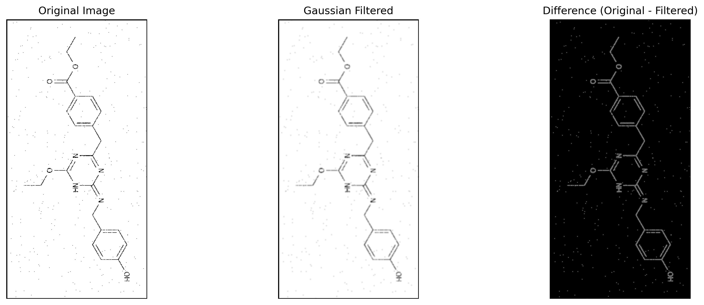
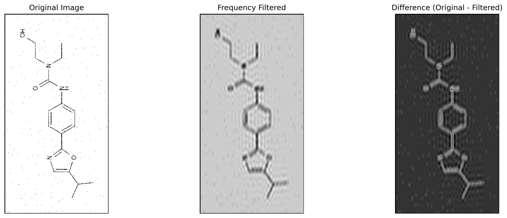
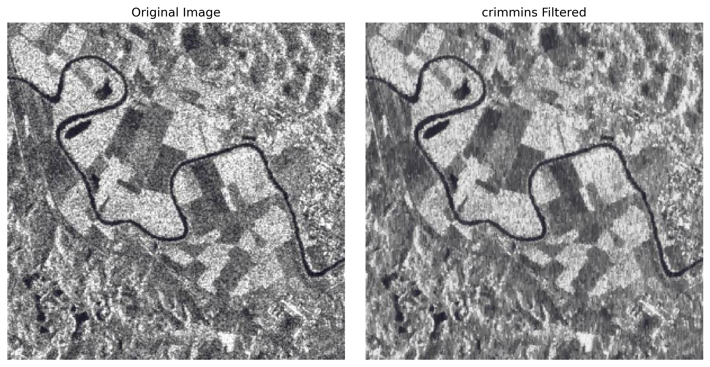
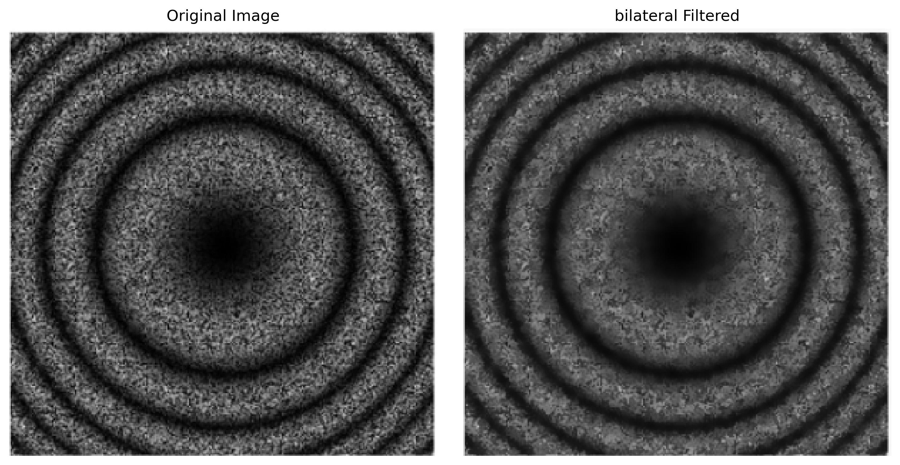
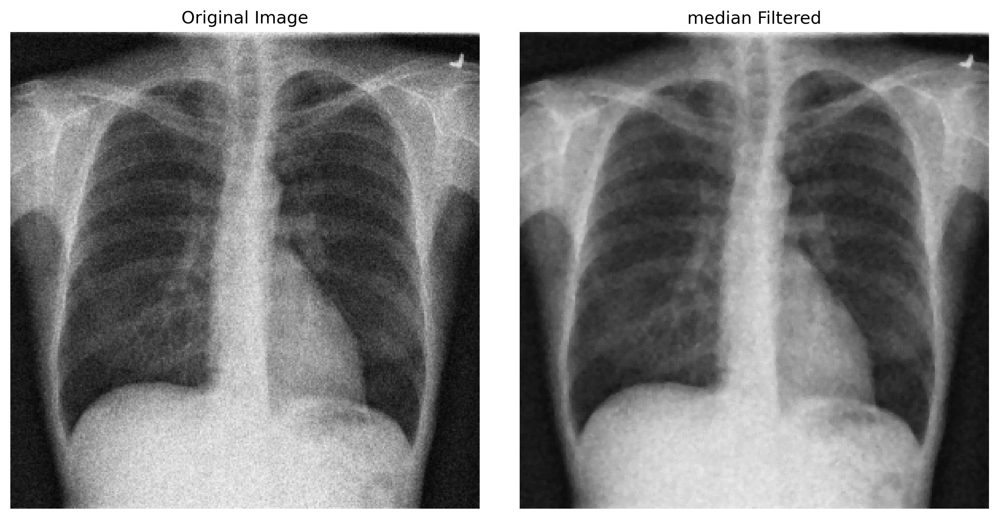
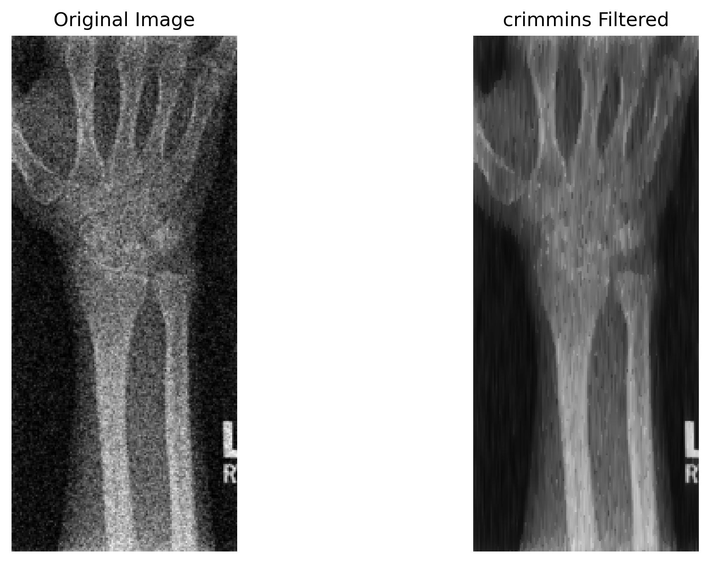
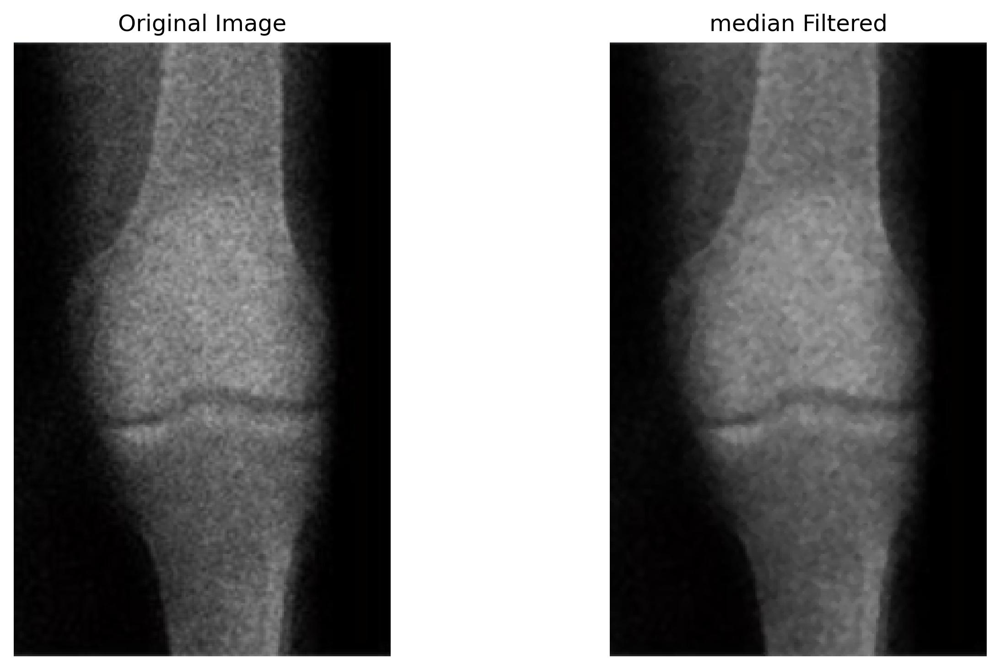
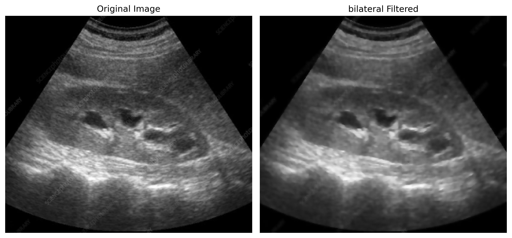

# Assignment 3

This repository contains the source code and images for Assignment 3.

## Structure
  - `nosiy`The folder that is been provided by the instructor, make sure it is in the same folder with other scripts

  - `utils.py` Contains the filter and image processing functions
  - `task1-plot-outputs` and `task2-plot-outputs` contain the images for the report of my work.
  - the other scripts are for assignments.

## Assignments 

- [Part 1](#part-1)
- [Part 2](#part-2)
- [Part 3](#part-3)
- [How to run](#how-to-run)
---
## Part 1
Based on a seed, I have chosen 3 random images, and on different kernels/functions, the program randomly picks from those 3 elements.
Aside from learned techniques in the class, I present my own approach for this task, which significantly outperforms other approaches due to the nature of these images.
To simplfy the management of program, I have generated a map that contains method names, which are used for both calling the corresponding functions and generating names for outputs. You can save the result of methods seperately.

### Filtering Method Mapping and Analysis
Generally speaking, I could divide the results of algorithms into two categories:
  - Kernels/methods with bad result : median filter, closing
  - Kernels that made small difference by smoothing: mean, gaussian, bilateral, and others
  - The best one : my own method
---
## Denoising Results — Task 1: Chemical Images
The first image is the original one, second is the result of method and last one is their difference, helping us to see what method has removed from the image.

### Filters that made small difference
These methods and some other that I haven't put here almost had the same tendency. They didn't remove the noise, but made them more smoother, making them look less obvious.

###  Mean Filter  

  

###  Gaussian Filter  

  

###  Crimmins Speckle Removal  

  

---

##  Worst Methods

###  Median Filter  
_The worst filter appears to be Median filter as it doesn't give any useful output._

  

###  Morphological Closing  
_Better than Median filter, but it also removed the details of the chemical._

  

---

##  Methods with Different Behavior

###  Frequency Low-Pass Filter  
_As Frequency methods work in a different manner, it had a totally different result from others, but did not really remove the noise — they are just too small to be visible._

  

---

## 🏆 Best Result

###  Conservative Smoothing  
_If you take a look at the image differences, you’ll only see small dots — meaning that this method only removed the noise while keeping structure._

  

### Aghax Kernel Method  
_This method works by counting black pixels inside a square; if below a threshold, it removes them as noise._

  

---

## Part 2
In this part, I will only put the best results based on my qualitative analysis, you can run `a2.py` and try for different methods on the speckle images.
<!-- You can change this width to 400, 500, etc. -->
<!-- WIDTH = 700 -->

<h3> Task 2: Denoising Results (Speckle Noise)</h3>

  
   Speckle 1 - Crimmins Filter with 6 iterations

  
   Speckle 2 - Bilateral Filter (diameter 6, sigma color and space 75)

  
   Speckle 3 - Median Filter

  
   Speckle 4 - Crimmins Filter with 10 iterations

  
   Speckle 5 - Median Filter

  
   Speckle 6 - Bilateral Filter (diameter 9, sigma color and space 75)

### Part 3
Run `downloader.py` script to download dicom file from the link you have provided, it should download to the same directory with the script, do not change it.
Run `a3.py`, as it provides an interactive tool for playing the images as a loop forward and backwards, u can also use the slider for seeing the different images based on slider value. You can specify the values you want to appear on the list, and it will print the ones which are not empty. By default, it will print all the data that are not empty.

You can save images after execution, to do so, set `save` variable to. It will save the result image in `outputs\output{assignment_number}\` with given file name using `save_image` function. Alternatively, you can save the output of the plots by setting `save_plot` to True.

## How to run

~~~
git clone https://github.com/ADA-GWU/a3-digital-image-pre-processing-aghayevagha.git
cd a3-digital-image-pre-processing-aghayevagha
~~~

Install the necessary libraries
~~~
pip install opencv-python numpy matplotlib scikit-image scikit-learn pydicom scipy
~~~
  - run `downloader.py` to install the dicom file.
  - run `a1.py`, `a2.py`, `a3.py` for corresponding parts of the assignments, example:
~~~
python a1.py
~~~
